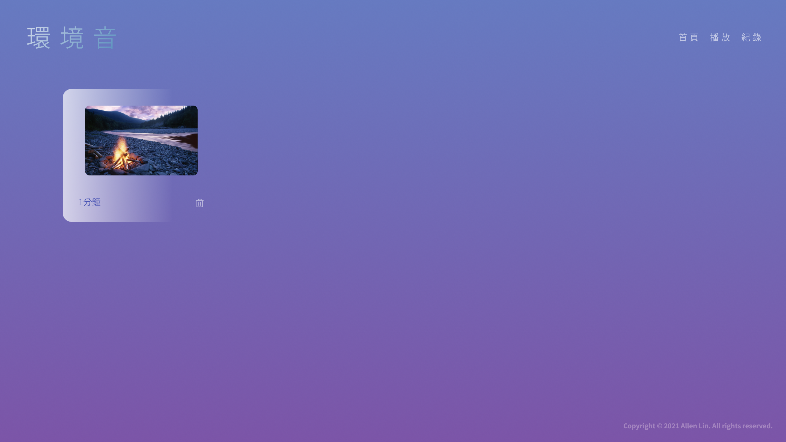

# Atmosphere
A website for playing atmosphere sound, such as ocean or campfire sound.

## Demo
| Home Page | Select Time |
| --- | --- |
|  |  |
| Playing | Record Page |
|  |  |

## How to run the website
1. git clone or download the project
2. make sure you have docker pre-installed
3. run `docker compose up`
  - If there is some functionailty fails, please stop it (Ctrl+C) and run it again by `docker compose up` 
4. open the websit with the URL: http://localhost:8080

## Declaration
This website is not for commercial usage.
